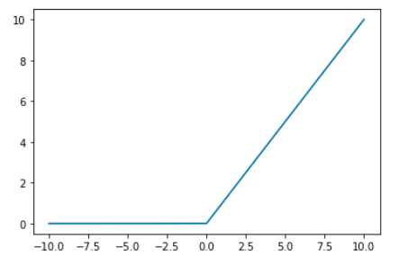
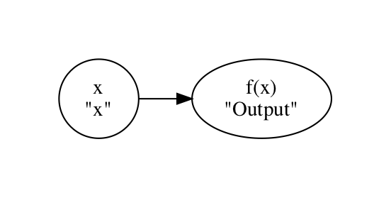
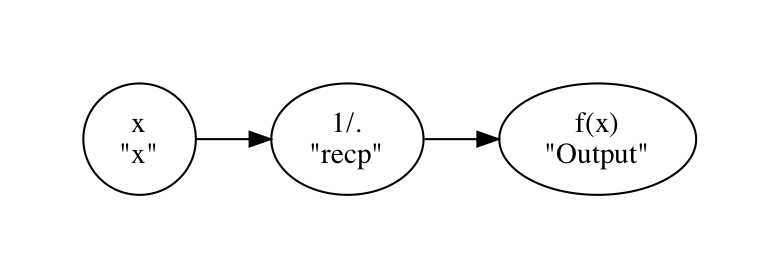
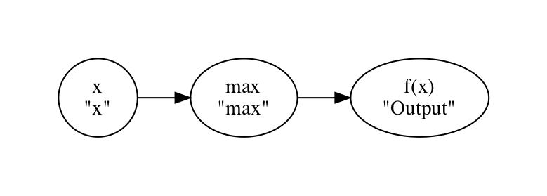
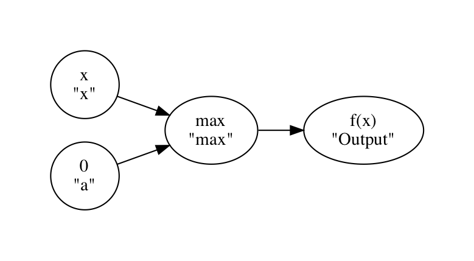
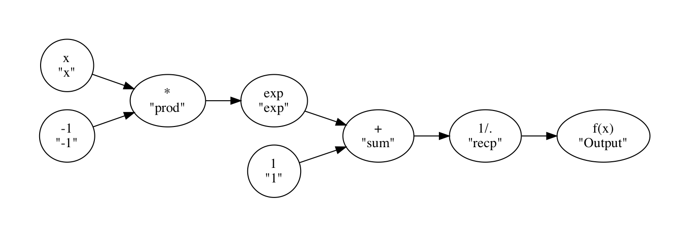
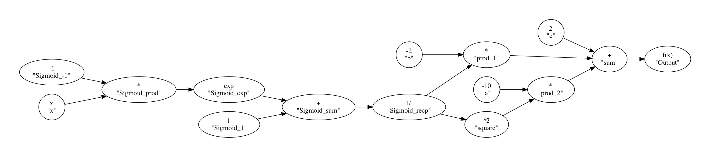

# afgraph
Arbitrary Function Graphs

Arbitrary Function Graphs

Afgraph is a programmatic mathematical function interface written in Python and capable of running through numpy or tensorflow. It was developed with a focus on enabling activation functions of neural networks to be evolved using genetic algorithms. 

# Example:

The standard activation function is ReLU
```python
def relu(x):
  return max(0, x)
```

However, this function could be "evolved" or changed randomly by chance to a set of neighbors:

```python
def relu_n1(x):
  return max(0, x-a)
  
def relu_n2(x):
  return max(b, x)
  
def relu_n3(x):
  return max(b, x**2)

...

def relu_ni(x):
  return max(b, sin(x))
```

Normally this would require a user to code these functions, but with afgraph, a base function can be written, and then it can be modified programmatically, recompiled in numpy or tensorflow, and used in any setting with no coding.

```python
from afgraph.function.tree import FunctionTree
from afgraph.function.node import Max, Constant

def ReLU():
    test_graph = FunctionTree('ReLU')
    max_node = Max('max')
    const_node = Constant('a', 0)
    test_graph.insert_node(max_node, 'Output', 'x')
    test_graph.insert_node(const_node, 'max')
    return test_graph
```

ReLU can then be:
+ compiled into tensorflow function;
  ```python
  relu = ReLU()
  f = test.get_tensorflow()
  print(f(np.random.rand(3,3)))
  ```
  ```python
  array([[0.61421275, 0.77908075, 0.36841294],
         [0.15692288, 0.765053  , 0.324683  ],
         [0.46453375, 0.53577733, 0.69865566]], dtype=float32)
  ```
+ seen as a graph;
  ```python
  relu.get_graph()
  ```
  
+ plotted;
  ```python
  relu.get_plot(np.arange(-10, 10, .001)
  ```
  
+ made into numpy code;
  ```python
  print(test.get_numpy_str())
  ```
  ```python
  def f(x):
      return np.max([0*np.ones_like(x), x], axis = 0)
  ```
+ made into latex code;
  ```python
  print(test.get_latex_str())
  ```
  ```python
  f(x) = max(0, x)
  ```
+ and much more

## Evolution.
**Note** This is still being worked on, but afgraph offers several programmatic ways to change a function graph. All through a standard API interface that can be used to define how one graph changes to the next.
1. Insert Node between two feasible nodes
    
    Pre Insert:
    ```python
    test_graph = FunctionTree('example1')
    relu.get_graph()
    ```
    
    
    Post Insert:
    ```python
    test_graph = FunctionTree('example1')
    recp_node = Reciprocal('recp')
    test_graph.insert_node(recp_node, 'Output', 'x')
    test_graph.get_graph('example1_post')
    ```
    
2. Insert Node as a child of a feasible node

    Pre Insert:
    ```python
    test_graph = FunctionTree('example2')
    max_node = Max('max')
    const_node = Constant('a', 0)
    test_graph.insert_node(max_node, 'Output', 'x')
    test_graph.get_graph('example2_pre')
    ```
    
    
    Post Insert:
    ```python
    test_graph = FunctionTree('example2')
    max_node = Max('max')
    const_node = Constant('a', 0)
    test_graph.insert_node(max_node, 'Output', 'x')
    test_graph.get_graph('example2_pre')
    test_graph.insert_node(const_node, 'max')
    test_graph.get_graph('example2_post')
    ```
    
3. Insert another function graph between two feasible nodes
4. Insert another function graph as a child of a feasible node
5. Replace node with another acceptable node
6. Connect two feasible nodes
7. Remove node and reconnect parent and child nodes:
8. And more!

# More complicated Examples!

## Sigmoid
Using the standard Sigmoid Function as: sg(x) = 1/(1+e^-x)
We implement it into afgraph as such
```python
def Sigmoid():
    test_graph = FunctionTree('Sigmoid')
    recp_node = Reciprocal('recp')
    const_node_p1 = Constant('1', 1)
    const_node_m1 = Constant('-1', -1)
    sum_node = Sum('sum')
    exp_node = Exp('exp')
    prod_node = Product('prod')

    test_graph.insert_node(recp_node, 'Output', 'x')
    test_graph.insert_node(sum_node, 'recp', 'x')
    test_graph.insert_node(exp_node, 'sum', 'x')
    test_graph.insert_node(prod_node, 'exp', 'x')
    test_graph.insert_node(const_node_m1, 'prod')
    test_graph.insert_node(const_node_p1, 'sum')
    return test_graph
    
sg = Sigmoid()
sg.get_graph('sigmoid_example')
```


afgraph will also give the "human" readable string for it.
```python
print(sg.get_latex_str())
```
```python
f(x) = 1/((1 + exp((-1*x))))
```
afgraph can also write it as numpy code or complie it into tensorflow code.
```python
print(sg.get_numpy_str())
```
```python
def f(x):
    return np.reciprocal(np.sum([1*np.ones_like(x) ,np.exp(np.product([-1*np.ones_like(x), x], axis = 0))], axis = 0))
```
    
## Quadratic of Sigmoid
Using the standard definition of a quadratice function f(x) = ax^2 + bx + cx, we can compose f(g(x)), where g(x) is the sigmoid function.

f(g(x)) = a*g(x)^2 + b*g(x) + c

While this seems like a quite complicated function, using afgraph, it is quite easy!

```python
def Quadratic_of_Sigmoid(a=1, b=2, c=3):
    test_graph = Quadratic(a=a, b=b, c=c)
    temp_test_graph = Sigmoid()
    test_graph.insert_tree(temp_test_graph, 'x')
    return test_graph
    
f_g = Quadratic_of_Sigmoid()
f_g.get_graph('quadratic_of_sigmoid')
```



# Help Wanted (or more realistically Needed)
This project is nowhere near done. I have not had time to flesh out this project entirely, but I would love to answer questions or find someone interested in continuing to work on this project with me. Please contact me at tim.nonet@gmail.com.

